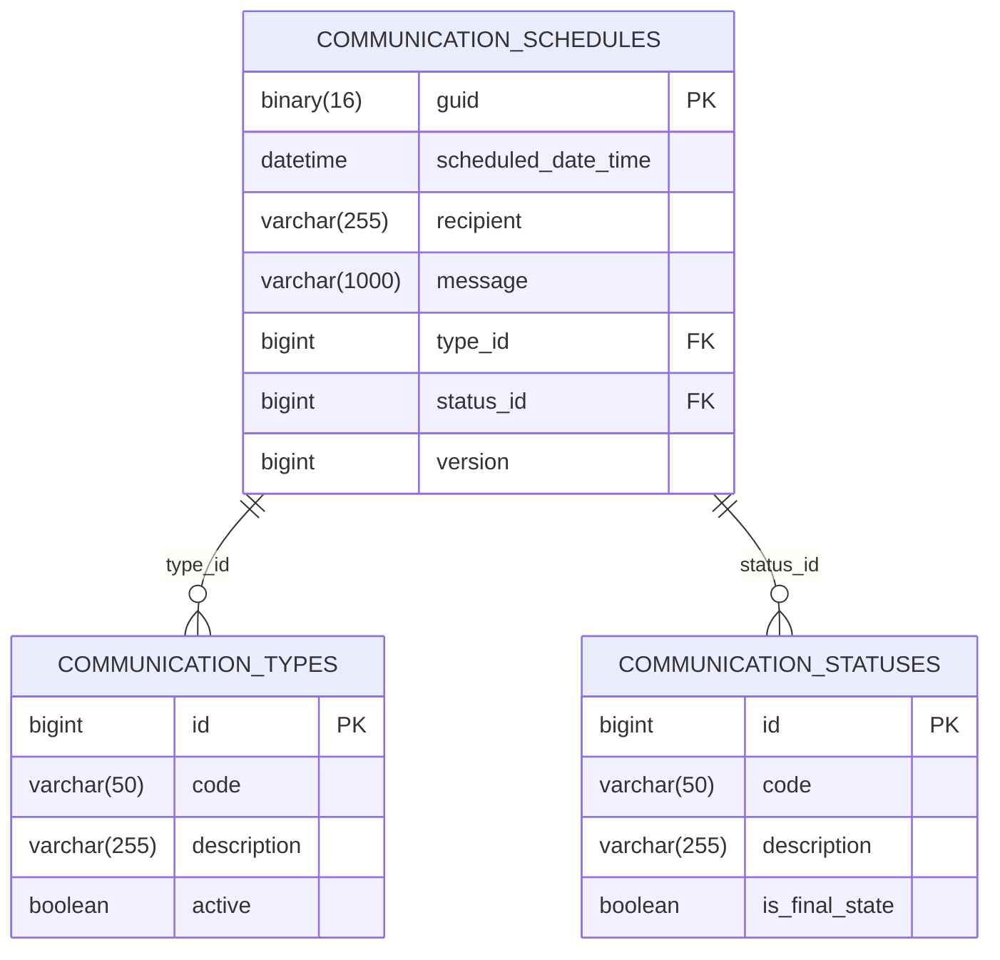

# Communication-LuizaLabs

## 📡 Desafio Técnico Luiza Labs - Plataforma de Agendamento de Comunicação - Magalu

## 📋 Descrição
Solução completa para agendamento de comunicações com:
- Versionamento de API (v1)
- Documentação Swagger/OpenAPI
- Padrão DTO com Records
- Separação clara entre camadas

## 🔗 Endpoints

### Base URL: `http://localhost:8080/api/v1/communications`

| Método | Endpoint                          | Descrição                              | Status Codes |
|--------|-----------------------------------|----------------------------------------|--------------|
| POST   | `/`                               | Agenda nova comunicação                | 201, 400, 404|
| GET    | `/`                               | Lista agendamentos (paginação)         | 200          |
| GET    | `/{guid}`                         | Consulta agendamento específico        | 200, 404     |
| GET    | `/{guid}/status`                  | Consulta status do agendamento         | 200, 404     |
| DELETE | `/{guid}`                         | Cancela agendamento                    | 200, 400, 404|

## 📝 Exemplos de Uso

### 1. Agendar Comunicação
```http
POST /api/v1/communications
Content-Type: application/json

{
  "scheduledDateTime": "2025-12-31T23:59:59",
  "recipient": "cliente@exemplo.com",
  "message": "Olá! Sua fatura vence em 5 dias. Pagamento até 30/04 para evitar juros.",
  "type": "EMAIL",
  "status": "PENDING"
}

GET /api/v1/communications?page=0&size=10&sortField=createdAt&sortDirection=desc
Content-Type: application/json
{
    "content":[
        {"guid":"119467b1-4c40-4bf2-93df-363378fe9317",
        "scheduledDateTime":"2025-12-31T23:59:59",
        "recipient":"cliente@exemplo.com",
        "message":"Olá! Sua fatura vence em 5 dias. Pagamento até 30/04 para evitar juros.",
        "type":"EMAIL",
        "status":"CANCELED",
        "createdAt":"2025-03-30T14:20:37",
        "updatedAt":"2025-03-30T14:21:14"}
    ],
    "pageable":{
        "pageNumber":0,
        "pageSize":10,
        "sort":{
            "empty":false,
            "sorted":true,
            "unsorted":false
            },
            "offset":0,
            "paged":true,
            "unpaged":false
    },
    "last":true,
    "totalElements":1,
    "totalPages":1,
    "first":true,
    "size":10,
    "number":0,
    "sort": {
        "empty":false,
        "sorted":true,
        "unsorted":false
    },
    "numberOfElements":1,
    "empty":false
}

GET /api/v1/communications/:guid
{
    "guid": "119467b1-4c40-4bf2-93df-363378fe9317",
    "scheduledDateTime": "2025-12-31T23:59:59",
    "recipient": "cliente@exemplo.com",
    "message": "Olá! Sua fatura vence em 5 dias. Pagamento até 30/04 para evitar juros.",
    "type": "EMAIL",
    "status": "CANCELED",
    "createdAt": "2025-03-30T14:20:37",
    "updatedAt": "2025-03-30T14:21:14"
}

GET /api/v1/communications/:guid/status
{
    "code": "CANCELED",
    "description": "Cancelado pelo usuário",
    "isFinalState": true
}

GET /api/v1/communications/:guid
{
    "guid": "119467b1-4c40-4bf2-93df-363378fe9317",
    "scheduledDateTime": "2025-12-31T23:59:59",
    "recipient": "cliente@exemplo.com",
    "message": "Olá! Sua fatura vence em 5 dias. Pagamento até 30/04 para evitar juros.",
    "type": "EMAIL",
    "status": "CANCELED",
    "createdAt": "2025-03-30T14:20:37",
    "updatedAt": "2025-03-30T14:21:14.0551018"
}
```

## 🛠️ Tecnologias

| Componente       | Tecnologia                     |
|------------------|--------------------------------|
| Linguagem        | Java 21                        |
| Framework        | Spring Boot 3.4.4              |
| Banco de Dados   | MySQL                          |
| Documentação     | SpringDoc OpenAPI 2.8.6        |
| Build            | Maven                          |

## 📁 Diretórios e Arquivos
```
📂src/
├── main/
│   ├── java/
│   │   └── br/com/pauloultra/desafioluizalabs/
│   │       ├── config/swagger/
│   │       ├── controller/
│   │       ├── dto/
│   │             ├── request/
│   │             └── response/
│   │       ├── entity/
│   │       ├── exception/
│   │       ├── repository/
│   │       ├── service/
│   │       ├── utils/
│   │       ├── validator/
│   │       └── DesafioLuizaLabsApplication.java
│   └── resources/
│       ├── db/migration/
│       └── application.properties
└── test/
    ├── java/
        └── br/com/pauloultra/desafioluizalabs/
            ├── controller/
            └── service/
```

## 📚 Documentação

Acesse a documentação interativa:

🔗 [Swagger-UI](http://localhost:8080/swagger-ui.html)

🔗 [OpenAPI Spec](http://localhost:8080/v3/api-docs)

---

## 🔍 Validações Implementadas

### 📌 Tratamento Global de Exceções

```java
@Slf4j
@RestControllerAdvice
public class CustomExceptionHandler extends ResponseEntityExceptionHandler {
    
    @ExceptionHandler(ResourceNotFoundException.class)
    public ResponseEntity<Object> handleResourceNotFoundException(...) {
        // Retorna HTTP 422 (UNPROCESSABLE_ENTITY)
    }
    
    @ExceptionHandler(StatusException.class)
    public ResponseEntity<Object> handleStatusException(...) {
        // Retorna HTTP 400 (BAD_REQUEST)
    }
    
    @ExceptionHandler(IllegalArgumentException.class)
    public ResponseEntity<ExceptionalResponse> handleIllegalArgumentException(...) {
        // Retorna HTTP 400 (BAD_REQUEST)
    }
}
```

### 🛡️ Classes de Exceção Customizadas

| Classe                        | Descrição (Exemplos)             | HTTP Status |
|--------------------------------|----------------------------------|-------------|
| `ResourceNotFoundException`    | Communication resource not found | 422         |
| `StatusException`              | Canceled status not configured   | 400         |
| `IllegalArgumentException`     | Recipient field must be filled in                          | 400         |

### 📦 Resposta Padrão de Erros

```java
@Data
public class ExceptionalResponse {
    private LocalDateTime timestamp;  // Data/hora do erro
    private String message;          // Mensagem descritiva
    private HttpStatus status;       // Status HTTP
}
```

## ✅ Validações de DTOs (Records)

```java
public record CommunicationRequestDto(
    @NotNull @Future LocalDateTime scheduledDateTime,  // Data futura obrigatória
    @NotBlank @Size(max = 255) String recipient,      // Destinatário (1-255 chars)
    @NotBlank @Size(max = 1000) String message,       // Mensagem (1-1000 chars)
    @NotBlank String type,                            // Tipo de comunicação
    @NotBlank String status                           // Status inicial
) {}
```

## 🗄 Migrações do Banco de Dados

### Estrutura de Migrações (Flyway)
```sql
📂 db/
└── migration/
    ├── V1__Create_communication_tables.sql
    ├── V2__Insert_communication_types_data.sql
    ├── V3__Insert_communication_status_data.sql
    ├── V4__Refactoring_communication_types_and_communication_status.sql
    └── V5__Refactoring_communication_schedule.sql
```
### 📊 Diagrama do Modelo Final



# ♻️ Política de Migrações

- **Backward-compatible**: Todas as alterações mantêm compatibilidade com versões anteriores.
- **Atomicidade**: Cada migração é independente e pode ser revertida.
- **Dados de Referência**: Inseridos via migrations (não hardcoded).
- **Controle de Versão**: Flyway garante execução ordenada e tracking.

### Por que essa abordagem?

- **Flexibilidade para adicionar novos tipos/status via banco** (ex: adicionar "TELEGRAM" sem deploy).
- **Performance em produção** (IDs inteiros + BINARY(16)).
- **Controle**
- **Para controle de concorrência nativo (optimistic locking)**

## 🛠 Configuração

## ⚙️ Pré-requisitos

- Java JDK 21
- MySQL 8.0+
- Maven 3.9+


1. Clone o repositório:
```bash
  git clone https://github.com/Paulo-Ultra/Communication-LuizaLabs
```
## 🗃 Configuração do Banco

2. Crie o banco de dados:
```sql
CREATE DATABASE luizalabs_communication;
```
    Configure o application.properties:

3. Configure o application.properties:
```properties
spring.datasource.url=jdbc:mysql://localhost:3306/magalu_comunicacao
spring.datasource.username=seu_usuario
spring.datasource.password=sua_senha
spring.flyway.locations=classpath:db/migration
```

## 🚀 Como Executar
```bash
mvn spring-boot:run
```

## 🧪 Testes

### 📊 Cobertura de Testes

Execute os testes com:
```bash
mvn test
```

6. **Boas Práticas Implementadas** 
```markdown
## 🏆 Boas Práticas Implementadas

- [x] Versionamento de API (v1)
- [x] Documentação Swagger automática
- [x] Tratamento global de exceções
- [x] Validações robustas com Bean Validation
- [x] Migrações controladas com Flyway
- [x] Paginação em consultas
- [x] Optimistic Locking (controle de concorrência)
- [x] Separação clara entre camadas
```